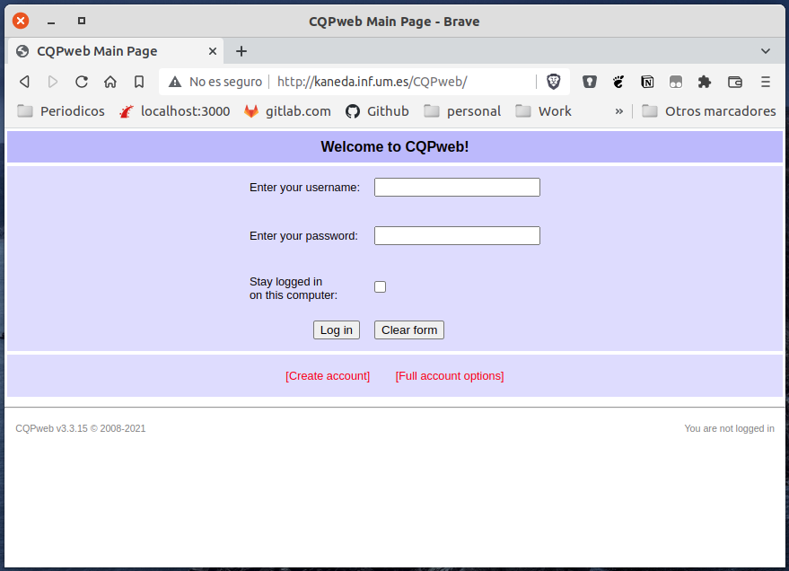
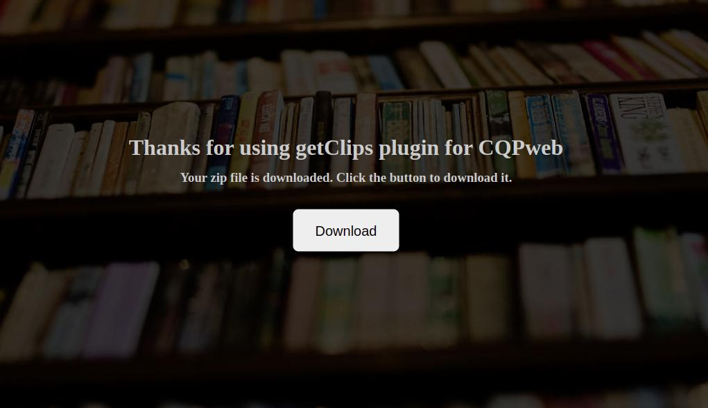

# CQPweb Corpus + GetClips Howto

# Git repository

You can find everything you will need to create a new instance of cqpweb with the getClips plugin in this repository.

There is a docker compose project that will run a working instance of cqpweb + mysql in container.

Admin user is: cqpwebadmin

Password: letmein

[https://github.com/daedalusLAB/cqpweb-docker](https://github.com/daedalusLAB/cqpweb-docker)

# Install and run CQPweb inside containers

```bash
raul@kaneda ~/tmp/cqpweb-docker>** git clone https://github.com/daedalusLAB/cqpweb-docker.git

raul@kaneda ~/tmp/cqpweb-docker> cd cqpweb-docker
raul@kaneda ~/tmp/cqpweb-docker> docker-compose build
db uses an image, skipping
Building cqpweb
Step 1/14 : FROM ubuntu:20.04
 ---> 53df61775e88
Step 2/14 : RUN apt-get update && DEBIAN_FRONTEND=noninteractive apt install -y     apache2 subversion php build-essential r-base libapache2-mod-php php-mysql php-gd sendmail mysql-client php-mbstring curl bash zip     && svn co http://svn.code.sf.net/p/cwb/code/cwb/trunk cwb &&     svn co http://svn.code.sf.net/p/cwb/code/perl/trunk cwb-perl &&     mkdir -p /data/corpora/cqpweb/upload /data/corpora/cqpweb/tmp /data/corpora/cqpweb/corpora /data/corpora/cqpweb/registry &&     chown -R www-data /data/corpora
 ---> Running in 3181284776e9
Get:1 http://archive.ubuntu.com/ubuntu focal InRelease [265 kB]
Get:2 http://security.ubuntu.com/ubuntu focal-security InRelease [114 kB]
Get:3 http://archive.ubuntu.com/ubuntu focal-updates InRelease [114 kB]
Get:4 http://archive.ubuntu.com/ubuntu focal-backports InRelease [108 kB]
Get:5 http://archive.ubuntu.com/ubuntu focal/restricted amd64 Packages [33.4 kB]
Get:6 http://archive.ubuntu.com/ubuntu focal/multiverse amd64 P
.
.
.
. # MUCH MORE LINES. CAN LAST SOME MINUTES
.
.
.
Step 12/14 : EXPOSE 80
 ---> Running in 7f266c09a0e8
Removing intermediate container 7f266c09a0e8
 ---> 64725723f6c4
Step 13/14 : COPY entrypoint.sh /root/entrypoint.sh
 ---> 9bd78101822e
Step 14/14 : ENTRYPOINT [ "/root/entrypoint.sh" ]
 ---> Running in 5900eb91c97a
Removing intermediate container 5900eb91c97a
 ---> 09972ebcd6df

Successfully built 09972ebcd6df
Successfully tagged cqpweb-docker_cqpweb:latest

raul@kaneda ~/tmp/cqpweb-docker> docker-compose up -d
Starting cqpweb-docker_db_1 ... done
Starting cqpweb-docker_cqpweb_1 ... done
```

Now CQPWeb images are created and is running in background. You can stop it this way:

```bash
raul@kaneda ~/tmp/cqpweb-docker> docker-compose stop
```

You can see CQPweb logs this way:

```bash
raul@kaneda ~/tmp/cqpweb-docker> docker-compose logs
db_1      | 2022-06-17T09:09:45.563862Z 0 [Note] InnoDB: Buffer pool(s) load completed at 220617  9:09:45
db_1      | 2022-06-17T09:09:45.564242Z 0 [Note] Found ca.pem, server-cert.pem and server-key.pem in data directory. Trying to enable SSL support using them.
db_1      | 2022-06-17T09:09:45.564249Z 0 [Note] Skipping generation of SSL certificates as certificate files are present in data directory.
db_1      | 2022-06-17T09:09:45.564251Z 0 [Warning] A deprecated TLS version TLSv1 is enabled. Please use TLSv1.2 or higher.
db_1      | 2022-06-17T09:09:45.564253Z 0 [Warning] A deprecated TLS version TLSv1.1 is enabled. Please use TLSv1.2 or higher.
db_1      | 2022-06-17T09:09:45.564593Z 0 [Warning] CA certificate ca.pem is self signed.
db_1      | 2022-06-17T09:09:45.564613Z 0 [Note] Skipping generation of RSA key pair as key files are present in data directory.
db_1      | 2022-06-17T09:09:45.564901Z 0 [Note] Server hostname (bind-address): '*'; port: 3306
db_1      | 2022-06-17T09:09:45.564920Z 0 [Note] IPv6 is available.
db_1      | 2022-06-17T09:09:45.564927Z 0 [Note]   - '::' resolves to '::';
db_1      | 2022-06-17T09:09:45.564934Z 0 [Note] Server socket created on IP: '::'.
db_1      | 2022-06-17T09:09:45.570975Z 0 [Warning] Insecure configuration for --pid-file: Location '/var/run/mysqld' in the path is accessible to all OS users. Consider choosing a different directory.
db_1      | 2022-06-17T09:09:45.578081Z 0 [Note] Event Scheduler: Loaded 0 events
db_1      | 2022-06-17T09:09:45.578214Z 0 [Note] mysqld: ready for connections.
db_1      | Version: '5.7.38'  socket: '/var/run/mysqld/mysqld.sock'  port: 3306  MySQL Community Server (GPL)
cqpweb_1  | Waiting to mysql to be ready
cqpweb_1  | mysqladmin: [Warning] Using a password on the command line interface can be insecure.
cqpweb_1  | mysqladmin: [Warning] Using a password on the command line interface can be insecure.
cqpweb_1  | mysqld is alive
cqpweb_1  | execute autosetup.php
cqpweb_1  | 
cqpweb_1  | Now finalising setup for this installation of CQPweb....
cqpweb_1  | 
cqpweb_1  | Installing database structure; please wait.
cqpweb_1  | 
cqpweb_1  | Database setup complete.
cqpweb_1  | 
cqpweb_1  | Now, we must set passwords for each user account specified as a superuser.
cqpweb_1  | 
cqpweb_1  | Account setup complete for ``cqpwebadmin''
cqpweb_1  | --- done.
cqpweb_1  | 
cqpweb_1  | Storing best collations for optimal use of your database's Unicode handling ...
cqpweb_1  | --- done.
cqpweb_1  | 
cqpweb_1  | Creating built-in mapping tables...
cqpweb_1  | --- done.
cqpweb_1  | 
cqpweb_1  | Autosetup complete; you can now start using CQPweb.
****
```

<aside>
💡 CQPweb working! Username: cqpwebadmin. Password: letmein

</aside>



# Create corpus with vrts

## Preindex corpus through cwb

We have several vrts created with RedHen Pipeline. One per video. In this example I’m going to use only a few of them. This vrts files can be found under src/example_vrts folder.

Our corpus name will be: **test**

First of all we have to create a corpus.txt file to populate our corpus database with the content of all the vrt’s files.

```bash

raul@kaneda ~/tmp/cqpweb-docker> cd src/example_vrts
raul@kaneda ~/tmp/cqpweb-docker/src/example_vrts> echo "<corpus id=\"test\">" > corpus.txt
raul@kaneda ~/tmp/cqpweb-docker/src/example_vrts> cat *.vrt >> corpus.txt
raul@kaneda ~/tmp/cqpweb-docker/src/example_vrts> echo "</corpus>" >> corpus.txt

raul@kaneda ~/tmp/cqpweb-docker/src/example_vrts> cp ../run_parallel_cwb-make_CORPUSNAME.sh run_parallel_cwb-make_test.sh
```

Modify file and replace **CORPUSNAME** with **test**

```bash
#!/bin/bash

data="/data/corpora/cqpweb/corpora/**test**"
regfile="**test**"
name="**test**"
registry="/data/corpora/cqpweb/registry"
infile="/tmp/corpus.txt"
threads="10"

export CORPUS_REGISTRY="$registry"

cwb-encode -c utf8 -d $data -f $infile -R "$registry/$regfile" -xsB -P pos -P lemma -P wc -P lemma_wc -P orig -P ner -P normner -P tagsbefore/ \
        -P tagsafter/ -P timex -P whatever1 -P whatever2 -P root -P indep/ -P out_acl/ -P out_advcl/ -P out_advmod/ -P out_amod/ -P out_appos/ -P out_aux/ -P out_auxpass/ -P out_case/ \
        -P out_cc/ -P out_ccomp/ -P out_compound/ -P out_conj/ -P out_cop/ -P out_csubj/ -P out_csubjpass/ -P out_dep/ -P out_det/ -P out_discourse/ -P out_dobj/ \
        -P out_expl/ -P out_iobj/ -P out_mark/ -P out_mwe/ -P out_neg/ -P out_nmod/ -P out_nsubj/ -P out_nsubjpass/ -P out_nummod/ -P out_parataxis/ -P out_punct/ \
        -P out_ref/ -P out_root/ -P out_xcomp/ -P out_other/ -P aligned_word -P is_aligned -P startsecs -P startcentisecs -P endsecs -P endcentisecs \
        -P duration -P phones/ -P phones_durations/ -P is_first_pass -P is_recognized \
        -S s:0+id+text+reltime -S text:0+id+collection+file+date+year+month+day+time+duration+country+channel+title+video_resolution+video_resolution_original+scheduler_comment+language+recording_location+program_id+original_broadcast_date+original_broadcast_time+original_broadcast_timezone+local_broadcast_date+local_broadcast_time+local_broadcast_timezone+teletext_page \
        -S turn:0 -S meta:0+type+description+value+originalvalue -S story:0 -S musicalnotes:0+value -0 corpus

# NICHT VERGESSEN, zus�tzlich zu den oben gelisteten muss noch "word" dazu.
#parallel -j $threads cwb-make "$name" ::: word pos lemma wc lemma_wc orig lower ner normner tagsbefore tagsafter timex root indep out_acl out_advcl out_advmod out_amod out_appos out_aux out_auxpass out_case out_cc out_ccomp out_compound out_conj out_cop out_csubj out_csubjpass out_dep out_det out_discourse out_dobj out_expl out_iobj out_mark out_mwe out_neg out_nmod out_nsubj out_nsubjpass out_nummod out_parataxis out_punct out_ref out_root out_xcomp out_other startsecs startcentisecs endsecs endcentisecs persononscreen speakeronscreen handmoving movingvertically movinghorizontally shouldermoving slidingwindow noslidingwindow notwithhead gestures timelinegestures timelinegestures_confidence

cwb-make "$name" word &
cwb-make "$name" pos &
cwb-make "$name" lemma &
cwb-make "$name" wc &
cwb-make "$name" lemma_wc &
cwb-make "$name" orig &
# cwb-make "$name" lower &
cwb-make "$name" ner &
cwb-make "$name" normner &
cwb-make "$name" tagsbefore &
cwb-make "$name" tagsafter &
cwb-make "$name" timex &
cwb-make "$name" whatever1 &
cwb-make "$name" whatever2 &
cwb-make "$name" root &
cwb-make "$name" indep &
cwb-make "$name" out_acl &
cwb-make "$name" out_advcl &
cwb-make "$name" out_advmod &
cwb-make "$name" out_amod &
cwb-make "$name" out_appos &
cwb-make "$name" out_aux &
cwb-make "$name" out_auxpass &
cwb-make "$name" out_case &
cwb-make "$name" out_cc &
cwb-make "$name" out_ccomp &
cwb-make "$name" out_compound &
cwb-make "$name" out_conj &
cwb-make "$name" out_cop &
cwb-make "$name" out_csubj &
cwb-make "$name" out_csubjpass &
cwb-make "$name" out_dep &
cwb-make "$name" out_det &
cwb-make "$name" out_discourse &
cwb-make "$name" out_dobj &
cwb-make "$name" out_expl &
cwb-make "$name" out_iobj &
cwb-make "$name" out_mark &
cwb-make "$name" out_mwe &
cwb-make "$name" out_neg &
cwb-make "$name" out_nmod &
cwb-make "$name" out_nsubj &
cwb-make "$name" out_nsubjpass &
cwb-make "$name" out_nummod &
cwb-make "$name" out_parataxis &
cwb-make "$name" out_punct &
cwb-make "$name" out_ref &
cwb-make "$name" out_root &
cwb-make "$name" out_xcomp &
cwb-make "$name" out_other &
cwb-make "$name" aligned_word &
cwb-make "$name" is_aligned &
cwb-make "$name" startsecs &
cwb-make "$name" startcentisecs &
cwb-make "$name" endsecs &
cwb-make "$name" endcentisecs &
cwb-make "$name" duration &
cwb-make "$name" phones &
cwb-make "$name" phones_durations &
cwb-make "$name" is_first_pass &
cwb-make "$name" is_recognized &
wait
```

Copy corpus.txt and run_parallel_cwb-make_test.sh inside the container and exec a terminal inside it. Create data folder and execute script

```bash

docker cp run_parallel_cwb-make_test.sh cqpweb-docker_cqpweb_1:/tmp
docker cp corpus.txt cqpweb-docker_cqpweb_1:/tmp
docker exec -it cqpweb-docker_cqpweb_1 bash
root@350edeb5952b:/# mkdir /data/corpora/cqpweb/corpora/test
root@350edeb5952b:/# cd /tmp
root@350edeb5952b:/tmp# ./run_parallel_cwb-make_test.sh
Undeclared element attribute <s file=...> ignored (file /tmp/corpus.txt, line #5, warning issued only once).
Undeclared element attribute <s starttime=...> ignored (file /tmp/corpus.txt, line #5, warning issued only once).
```

## Install corpus already indexed (test)

Navigate to “Install new Corpus” in Admin Control Panel page and click in  “Switch to: install a corpus aready indexed in CWB outside CQPweb”


And fill corpus name and description


And click in “Design and insert a text-metadata table for the corpus (searches won't work till you do)”


This page shows the text metadata, but note the change in colour. **We are now in the test corpus area of CQPweb (no longer in the admin area).** 

Note: the metadata table has not been created. This is what we want to complete in the stages below by annotating the corpora.

## Creatting a mapping table

Before we annotate the corpus, this project requires a custom mapping table to be used. We need to build this first.

**Skip this step if you have already created the mapping table - move onto the annotating the corpus stage.**

To do this, click ‘go to admin control panel’ on the left panel. This will take us back into the global admin settings (note the colour change again).

From here, click ‘mapping tables’ under the ‘frontend interface’ section of the left panel. The screenshot below shows the mapping table page.


We are going to create our own mapping table. An ID_name is entered into the ID_code (note: only letters, numbers and _ are accepted as inputs). E.g. ‘wc_identity_mapping’

Add a description of your mapping table into the next box: e.g. ‘Erlangen Word Classes Identity Mapping’.

In the ‘mapping table code here’ box, enter your desired mappings. The format of this should be as follows:

```
{"A" : "ADJ",
"N" : "SUBST",
"V" : "VERB",
"$" : "PUNC",
"ADJ" : "ADJ",
"ADV" : "ADV",
"CONJ/PREP" : "CONJ/PREP",
"DET" : "DET",
"INTERJ" : "INTERJ",
"PRON" : "PRON",
"PUNC" : "PUNC",
"SUBST" : "SUBST",
"UNC" : "UNC",
"VERB" : "VERB"}
```


Click ‘Create mapping table’

And as result we’ll get 


Ensure Erlangen Word Classes Identity Mapping. Is the last one.

## Anottating corpus

Now we have created a mapping table, we can return to the annotation of the corpus.

Click ‘show corpora’ and select your corpus to annotate from the listed corpora. This returns us to the main corpus query page (color changed again).

Click ‘**manage annotation’** on the left panel under ‘admin tools’.

In the top panel, select the primary, secondary, tertiary and combination annotation desired. In ‘tertiary annotation mapping table’ select the mapping table you created from the dropdown.

For the current project, the following options are selected (see screenshot).

```
# Primary : pos
# Secondary : lemma
# Tertiary : wc
# Tertiary annotation mapping table : Erlangen Word Classes Identity Mapping
# Combination : lemma_wc
```


# Click ‘Update CEQL bindings’

Next, we will add the annotation metadata.

On the bottom half of this page, the attributes we added in the indexing process should be displayed in the table. From this, we want to select the attributes we want to annotate our corpus with. Select which attributes you want by selecting ‘Y’ in the ‘Needs FT’ column, clicking ‘apply’ for each one.

Add the descriptions to the desired handles (for this, I used the handle names).

For the ‘Collation’ column, this sets accent and case sensitivity (AS = Sensitive to accent, AI = Insensitive to accent, CS = Sensitive to case, CI = Insensitive to case). Select these as desired. 

**For this project, we left both case and accent sensitivity on. The attributes/handles selected were ‘pos’, ‘lemma’, ‘wc’, ‘lemma_wc’ and ‘orig’, all others were left with ‘N’ selected.**

See screenshot for selection and settings of the project.


Mark N and click ‘Apply’ for every attribute till end of the page. It is tedious 😖

## Create metadata table

Click ‘**Manage text metadata**’ on the left panel.

We are now going to build the metadata table that is required for us to run queries on our corpus.

We want to select the bottom option: ‘install metadata from within-corpus XML annotation’. This is because the corpus contains the metadata we want within the XML, so this information is already within the corpus itself.

[https://lh4.googleusercontent.com/OxjouBzv2BPGYl_FXlwRAPGuo2DKF5FocwktgMAzSRVea-0ZJO9k06Kk8CPZkCd01FCADiYvcOMUPnUKijnGzJSonh6j4RkAMMD7h3RD1ZK1yGpC50Owh1yqajTM-L6rS9su4ZTvYuSPobZltw](https://lh4.googleusercontent.com/OxjouBzv2BPGYl_FXlwRAPGuo2DKF5FocwktgMAzSRVea-0ZJO9k06Kk8CPZkCd01FCADiYvcOMUPnUKijnGzJSonh6j4RkAMMD7h3RD1ZK1yGpC50Owh1yqajTM-L6rS9su4ZTvYuSPobZltw)

click ‘Select text attributes’


Leave the ‘automatically run frequency-list setup’ as ‘No, thanks’ - we will do this later

Then click ‘create metadata table from XML using the settings above button’.

This will return us to the ‘admin tools for managing text metadata’ page, with the metadata status summary importantly changed to ‘The text metadata table **has been** created’.

## Create frecuency lists

Now we want to create ‘Frequency lists’ for our corpora. To do this, we click ‘Manage frequency lists’ from the ‘admin tools’ on the left panel.

Here, we need to click the ‘generate text corpus-position records’ button, then ‘Create frecuency tables’, then the ‘recreate CWB frequency cache’, and ‘recreate frequency tables’, selecting the ‘yes’ option when prompted.

Once completed, the screen will look as follows . This means we have successfully created the frequency tables.


**Our corpus is INSTALLED** and we can search inside it now

# getClips plugin

getClips plugin allows as to download as a .zip file a bunch of videos containing the exact clip of the video (Gentle through) since ‘2 seconds’ before and after the expression.

## Install plugin

Edit getClips.php file in your local machine and change settings you need. Mainly **download_url variable**. You can see here the interesting part of the file:

```bash
## CONFIGURATION SECTION
## Describe the pattern of the video link with {{video_id}}, {{start_time}} and {{end_time}}, e.g. as below for video_url_template. Change to suit needs.
  private array $settings = array(
    "headers_before_XML" => ["Number of hit", "Text ID", "Context before", "Query item", "Context after", "Tagged context before", "Tagged query item", "Tagged context after"],
    "headers_after_XML" => ["Matchbegin corpus position", "Matchend corpus position", "Video URL", "Video Snippet", "Video Snippet (long)", "Audio Snippet", "Audio Snippet (long)", "Screenshot"],
    "snippet_long_context" => 2, # Default here is seconds e.g. two seconds to either side
    "video_snippet_long_template" => "https://gallo.case.edu/cgi-bin/snippets/newsscape_mp4_snippet.cgi?file={{video_id}}&start={{start_time_long}}&end={{end_time_long}}",
    "download_url" => "http://kaneda.inf.um.es/CQPweb/downloads/",
    # download_path MUST exists and have right permissions. Web server must have write permissions to this directory.
    "download_path" => "/var/www/html/CQPweb/downloads/",
    "auto_download" => true, # If true, the download will be run automatically.
  );
```

and now

```bash
raul@kaneda ~/tmp/cqpweb-docker/src> docker cp getClips.php cqpweb-docker_cqpweb_1:/var/www/html/CQPweb/lib/plugins
raul@kaneda ~/tmp/cqpweb-docker/src> docker cp library.jpg cqpweb-docker_cqpweb_1:/var/www/html/CQPweb/downloads/
raul@kaneda ~/tmp/cqpweb-docker/src> docker cp index.php cqpweb-docker_cqpweb_1:/var/www/html/CQPweb/downloads/

raul@kaneda ~/tmp/cqpweb-docker/src> docker exec -it cqpweb-docker_cqpweb_1 bash
root@350edeb5952b:/# mkdir /var/www/html/CQPweb/downloads/
root@350edeb5952b:~# chmod 777  /var/www/html/CQPweb/downloads/
root@350edeb5952b:~# chown www-data.www-data /var/www/html/CQPweb/downloads/
```

## Activate plugin

Go to ‘CQPweb Admin Control Panel’ and click in ‘Manage plugins’.

Select getClips.php in ‘Select plugin code file’. Enter a description and click in ‘Register this plugin’. Then click in ‘Activate’


And then select ‘test’ in ‘Corpus’ and click in ‘Activate plugin for the specified corpus’


## Use plugin

### Search


Choose Action → Download


And click in ‘Download clips’


You'll get a page similar to this:



Server will download clips of the search in the right frames. 

It can last for a few seconds to a long long time if the number of videos is long. 

Click Download button to download the .zip file with the videos. 

You can change the file name when the browser asks for it.

If you decide to install the plugin without  **‘auto_download’** settings .zip file won’t be downloaded and you’ll get a file similar to this. URL will change.

```bash
########################################################################################## 
      ## Download process can last for long time. Please be patient.
      ## Please, wait some time and download the file from this URL:
      ## **http://kaneda.inf.um.es/CQPweb/downloads/2022-06-17-UTC11-06-06_s1Y3f8P5pUlHMyt4.zip**
 
      ## Zip files will be removed after 7 days.
      ## 
      ## Also you can download clips by yourself:
##########################################################################################

curl -L -o 640-1.mp4 "https://gallo.case.edu/cgi-bin/snippets/newsscape_mp4_snippet.cgi?file=ff061f98-bdfc-11e5-b923-2c600c9500f4&start=279.72&end=284.35"
curl -L -o 640-2.mp4 "https://gallo.case.edu/cgi-bin/snippets/newsscape_mp4_snippet.cgi?file=ff061f98-bdfc-11e5-b923-2c600c9500f4&start=1798.52&end=1803.52"
curl -L -o 640-3.mp4 "https://gallo.case.edu/cgi-bin/snippets/newsscape_mp4_snippet.cgi?file=94aef9d0-c491-11e5-943c-089e01ba0326&start=1040.96&end=1045.37"
curl -L -o 640-4.mp4 "https://gallo.case.edu/cgi-bin/snippets/newsscape_mp4_snippet.cgi?file=097335da-7098-11e6-90a9-089e01ba034d&start=99.99&end=104.36"
curl -L -o 640-5.mp4 "https://gallo.case.edu/cgi-bin/snippets/newsscape_mp4_snippet.cgi?file=097335da-7098-11e6-90a9-089e01ba034d&start=176.5&end=180.6"
curl -L -o 640-6.mp4 "https://gallo.case.edu/cgi-bin/snippets/newsscape_mp4_snippet.cgi?file=097335da-7098-11e6-90a9-089e01ba034d&start=601.3&end=605.79"
curl -L -o 640-7.mp4 "https://gallo.case.edu/cgi-bin/snippets/newsscape_mp4_snippet.cgi?file=097335da-7098-11e6-90a9-089e01ba034d&start=1355.77&end=1360.34"
curl -L -o 640-8.mp4 "https://gallo.case.edu/cgi-bin/snippets/newsscape_mp4_snippet.cgi?file=097335da-7098-11e6-90a9-089e01ba034d&start=1682.83&end=1687.32"
```


```bash
   "auto_download" => false, # If true, the download will be run automatically.
```

You can always download videos this way. Open a terminal in your computer and exec 

```bash
mkdir first_of_all_clips
cd first_of_all_clips
bash ../concordance.txt
```


